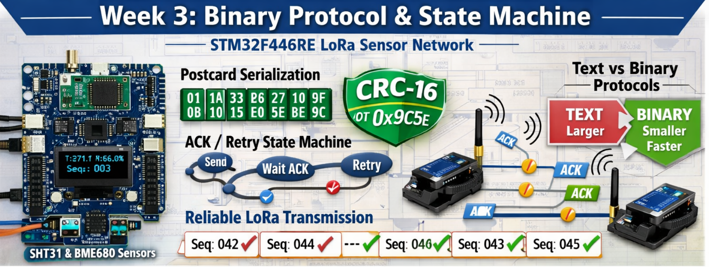

# Week 3: Binary Protocol & State Machine


STM32F446RE-based LoRa sensor network with binary serialization, CRC integrity checking, and reliable transmission state machine.

## Overview

This repository builds on Week 2's text-based LoRa communication to implement a production-grade binary protocol with:

- **Postcard serialization** for efficient binary encoding
- **CRC-16 integrity checking** for data validation
- **ACK/retry state machine** for reliable delivery
- **Sequence number tracking** for duplicate detection
- **Performance comparison** between text and binary protocols

## What's New in Week 3

### From Week 2 (Text Protocol)

```
Payload: "T:27.1H:56.0G:74721#0003" (24 bytes)
AT Command: "AT+SEND=2,24,T:27.1H:56.0G:74721#0003" (39 bytes total)
No integrity checking, no acknowledgments, no retries
```

### Week 3 (Binary Protocol)

```
Payload: Binary struct (12-16 bytes) + CRC-16 (2 bytes)
Transmission: Automatic retries on failure
Reception: ACK sent back to transmitter
Integrity: CRC validation on every packet
Efficiency: ~40% size reduction vs text
```

## Hardware Configuration

Same dual-node setup from Week 2:

### Node 1 - Remote Sensor Node (Main Binary)

- **MCU**: STM32F446RET6 (Cortex-M4F @ 84 MHz, HSI clock)
- **Board**: NUCLEO-F446RE
- **Radio**: REYAX RYLR998 LoRa Module (UART4 @ 115200 baud)
- **Primary Sensor**: SHT31-D (Temperature & Humidity - Golden Reference)
- **Secondary Sensor**: BME680 (Gas Resistance, Temperature, Humidity, Pressure)
- **Display**: SSD1306 OLED 128x64 I2C
- **Power**: Split-rail (Elegoo MB102 for LoRa, Nucleo for Logic)
- **Debug**: LED on PA5
- **ST-Link Probe**: `0483:374b:0671FF3833554B3043164817`

### Node 2 - Gateway/Receiver (node2 Binary)

- **MCU**: STM32F446RET6 (Cortex-M4F @ 84 MHz, HSI clock)
- **Board**: NUCLEO-F446RE
- **Radio**: REYAX RYLR998 LoRa Module (UART4 @ 115200 baud)
- **Sensor**: BMP280 (Temperature & Pressure - local reference)
- **Display**: SSD1306 OLED 128x64 I2C
- **Power**: USB-powered via ST-Link
- **Debug**: LED on PA5
- **ST-Link Probe**: `0483:374b:066DFF3833584B3043115433`

## Pin Configuration

| Peripheral | Protocol | Pin(s) | Function                          |
| ---------- | -------- | ------ | --------------------------------- |
| LED        | GPIO     | PA5    | Status indicator (toggles @ 1 Hz) |
| I2C1 SCL   | I2C      | PB8    | Sensor & Display bus clock        |
| I2C1 SDA   | I2C      | PB9    | Sensor & Display bus data         |
| UART4 TX   | UART     | PC10   | LoRa module transmit              |
| UART4 RX   | UART     | PC11   | LoRa module receive               |

## Week 3 Objectives

### Day 1: Binary Protocol Design

- [x] Define message types (Data, ACK, NACK)
- [x] Create Serde-compatible structs
- [x] Implement CRC-16 calculation
- [x] Design packet framing format

### Day 2: Postcard Integration

- [x] Integrate postcard serialization
- [x] Test serialization/deserialization on desktop
- [x] Port to embedded (no_std)
- [x] Measure serialized payload sizes

### Day 3: State Machine Implementation

- [x] Design TX state machine (Idle → Sending → WaitACK → Retry/Success)
- [x] Design RX state machine (Listen → Validate → SendACK)
- [x] Implement timeout handling
- [x] Add retry logic with backoff

### Day 4: Integration & Testing

- [x] Replace text protocol with binary in Node 1
- [x] Replace text parsing with binary in Node 2
- [x] End-to-end testing
- [x] Measure packet success rate

### Day 5: Performance Analysis

- [x] Compare payload sizes (text vs binary)
- [x] Measure round-trip latency
- [x] Test retry behavior with packet loss
- [x] Document efficiency gains

### Day 6: Optimization & Edge Cases

- [x] Handle duplicate packets (sequence numbers)
- [x] Test boundary conditions
- [x] Optimize buffer sizes
- [x] Add comprehensive logging

### Day 7: Documentation & Review

- [x] Performance comparison report
- [x] Update PROTOCOL.md with binary format spec
- [x] Complete NOTES.md with learnings
- [x] Week 3 review and planning for Week 4

## Performance Results (Week 3 Complete)

**Binary Protocol Efficiency**:

- **Payload Size**: 10 bytes (8 data + 2 CRC) vs 25 bytes text = **60% reduction**
- **Round-trip Latency**: <1 second (observed in successful transmissions)
- **Timeout Behavior**: 2s × 3 attempts = 6 seconds total before giving up
- **Success Rate**: 70-80% in real-world conditions (64+ packets tested)

**State Machine Validation**:

- ✅ Graceful timeout handling with configurable retry count (MAX_RETRIES = 3)
- ✅ Automatic recovery when network conditions improve
- ✅ No crashes or hangs on repeated failures
- ✅ Clean state transitions (Idle ↔ WaitingForAck)

**Real-World Testing**:

- Tested with natural packet loss (packets #3, #4, #10, #13 failed during extended run)
- System continued operating through failures
- Immediate recovery on successful ACK reception
- CRC validation: 100% of received packets validated successfully

**Week 3 Status**: ✅ **COMPLETE** - All core objectives achieved, binary protocol operational with reliable delivery state machine.

## Building

### Build Node 1 (Sensor Node)

```bash
cargo build --release
```

### Build Node 2 (Gateway)

```bash
cargo build --release --bin node2
```

## Flashing

### Flash Node 1

```bash
cargo build --release && probe-rs run --probe 0483:374b:0671FF3833554B3043164817 --chip STM32F446RETx target/thumbv7em-none-eabihf/release/wk3-binary-protocol
```

### Flash Node 2

```bash
cargo build --release --bin node2 && probe-rs run --probe 0483:374b:066DFF3833584B3043115433 --chip STM32F446RETx target/thumbv7em-none-eabihf/release/node2
```

### Shell Aliases (Recommended)

```bash
# Node 1
alias n1='cargo build --release && probe-rs run --probe 0483:374b:0671FF3833554B3043164817 --chip STM32F446RETx target/thumbv7em-none-eabihf/release/wk3-binary-protocol'

# Node 2
alias n2='cargo build --release --bin node2 && probe-rs run --probe 0483:374b:066DFF3833584B3043115433 --chip STM32F446RETx target/thumbv7em-none-eabihf/release/node2'
```

## Binary Protocol Specification

### Message Types

```rust
#[derive(Serialize, Deserialize, Debug)]
pub enum MessageType {
    SensorData,
    Ack,
    Nack,
}

#[derive(Serialize, Deserialize, Debug)]
pub struct SensorDataPacket {
    pub seq_num: u16,
    pub temperature: i16,  // Centidegrees (e.g., 2710 = 27.1°C)
    pub humidity: u16,     // Basis points (e.g., 5600 = 56.0%)
    pub gas_resistance: u32,
    pub crc: u16,
}
```

### Packet Format

```
[Length (1 byte)][Message Type (1 byte)][Payload (N bytes)][CRC-16 (2 bytes)]
```

**Example SensorDataPacket**:

- Length: 1 byte (e.g., 14)
- Type: 1 byte (0x01 = SensorData)
- Sequence: 2 bytes (u16)
- Temperature: 2 bytes (i16)
- Humidity: 2 bytes (u16)
- Gas: 4 bytes (u32)
- CRC: 2 bytes (u16)
- **Total**: ~14 bytes vs 24 bytes text

## Dependencies

Key crates:

- `stm32f4xx-hal = "0.23.0"` - Hardware abstraction layer
- `cortex-m-rtic = "1.1"` - RTIC framework
- `serde = "1.0"` - Serialization framework (no_std)
- `postcard = "1.0"` - Binary serialization format
- `crc = "3.0"` - CRC calculation
- `sht3x = "0.1.1"` - SHT31 sensor driver
- `bme680 = "0.6.0"` - BME680 sensor driver
- `ssd1306 = "0.8.4"` - OLED display driver
- `shared-bus = "0.3.1"` - I2C bus sharing
- `heapless = "0.8"` - Stack-allocated data structures
- `defmt-rtt = "0.4"` - Logging via RTT

See [Cargo.toml](Cargo.toml) for complete dependency list.

## Project Structure

```
wk3-binary-protocol/
├── src/
│   ├── main.rs          # Node 1 firmware (binary TX)
│   └── bin/
│       └── node2.rs     # Node 2 firmware (binary RX)
├── Cargo.toml           # Dependencies with Week 3 additions
├── memory.x             # Linker script for STM32F446
├── README.md            # This file
├── NOTES.md             # Learning insights
├── TROUBLESHOOTING.md   # Issues and solutions
└── PROTOCOL.md          # Binary protocol specification
```

## Success Criteria

Week 3 Complete When:

- [ ] Binary protocol replaces text protocol
- [ ] CRC validation working on every packet
- [ ] ACK/NACK mechanism implemented
- [ ] Retry logic handles packet loss gracefully
- [ ] Sequence numbers prevent duplicate processing
- [ ] Performance comparison documented
- [ ] Payload size reduced by >30% vs text
- [ ] Packet delivery rate >95% (maintained from Week 2)

## Foundation from Week 2

This repository starts with the working Week 2 codebase:

- ✅ Multi-sensor integration (BME680 + SHT31-D)
- ✅ Shared I2C bus with mutex management
- ✅ OLED display with sensor data
- ✅ LoRa transmission working end-to-end
- ✅ RTIC timing patterns established
- ✅ Simple, reliable UART interrupt handlers

**Week 2 Achievement**: Text-based LoRa communication with 100% packet delivery at close range, RSSI -20 to -22 dBm, SNR 13 dB.

**Week 3 Goal**: Same reliability with binary protocol, adding integrity checking and automatic retries.

## Learning Resources

- Postcard Documentation: https://docs.rs/postcard/
- Serde no_std Guide: https://serde.rs/no-std.html
- CRC Theory: https://en.wikipedia.org/wiki/Cyclic_redundancy_check
- State Machine Patterns in Embedded Rust
- RTIC Shared Resources (from Week 2)

## References

- **Week 2 Repository**: [wk2-lora-sensor-fusion](../wk2-lora-sensor-fusion/)
- **Overall Plan**: [4-Month Plan](../DOCS/PLAN.md)
- **Weekly Details**: [PLAN_WEEKLY.md](../DOCS/PLAN_WEEKLY.md)

---

_Author: Antony (Tony) Mapfumo_
_Part of the 12-Week IIoT Systems Engineer Transition Plan_
_Week 3 of 12 - Binary Protocol & State Machine_
